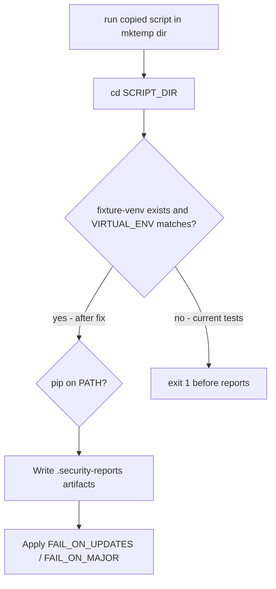

# Fix `04_run_dependency_freshness_checks` Bats Failures

## Root cause

`[04_run_dependency_freshness_checks.sh](04_run_dependency_freshness_checks.sh)` now gates execution on the same venv contract as `[03_load_requirements.sh](03_load_requirements.sh)` (lines 9–44): expected `<cwd-basename>-venv` must exist, `VIRTUAL_ENV` must be set, and it must resolve to that directory.

The failing suite `[testing/sh/04_run_dependency_freshness_checks.bats](testing/sh/04_run_dependency_freshness_checks.bats)` still uses a legacy pattern:

- Ad-hoc `mktemp -d` fixture roots (basename is random, e.g. `tmp.abc123`, not `fixture`)
- No `fixture-venv` directory
- No `VIRTUAL_ENV` export
- Custom `setup`/`teardown` instead of `[testing/sh/helpers/common.bash](testing/sh/helpers/common.bash)`

Because venv validation runs **before** the pip `command -v` check, every test dies early:


| Test                      | Expected behavior                              | Actual behavior                                          |
| ------------------------- | ---------------------------------------------- | -------------------------------------------------------- |
| R001…R025 artifact test   | Exit 1, write `.security-reports/`*            | Exits 1 on “Virtual environment not found!” — no reports |
| R005 missing pip          | Output contains `pip binary not found on PATH` | Output is venv error instead                             |
| R020 major / default fail | Exit 1, dependency messages                    | Venv error, no pip path                                  |
| R020 allow updates        | Exit 0                                         | Non-zero venv failure                                    |





## Recommended fix (tests only)

Refactor `[testing/sh/04_run_dependency_freshness_checks.bats](testing/sh/04_run_dependency_freshness_checks.bats)` to match the established pattern in `[testing/sh/03_load_requirements.bats](testing/sh/03_load_requirements.bats)` and `[testing/sh/06_run_security_checks.bats](testing/sh/06_run_security_checks.bats)`.

### 1. Adopt shared harness

- `load "helpers/common.bash"`
- `setup()`: `setup_shell_test`, `create_repo_fixture`, `copy_script_to_fixture "04_run_dependency_freshness_checks.sh"`
- `teardown()`: `teardown_shell_test`
- Drop bespoke `REPO_ROOT` / `TMP_ROOT` / manual `cp` of the script

Using `FIXTURE_ROOT="${TEST_TMPDIR}/fixture"` ensures `basename "$PWD"` is `fixture`, so the script looks for `**fixture-venv**` (consistent with other numbered-script tests).

### 2. Add a small local helper for happy-path runs

Add something like `setup_fixture_venv()` in the bats file (or inline in each test):

```bash
setup_fixture_venv() {
  mkdir -p "${FIXTURE_ROOT}/fixture-venv/bin"
}
```

For success-path tests, run via:

```bash
run bash -c "cd '${FIXTURE_ROOT}' && \
  export VIRTUAL_ENV=\"\$(cd '${FIXTURE_ROOT}/fixture-venv' && pwd -P)\" && \
  export PATH='${STUB_BIN}:'\${PATH} && \
  ./04_run_dependency_freshness_checks.sh"
```

### 3. Replace `create_pip_stub_with_updates` with `stub_cmd pip`

Port the stub body from the current helper into `stub_cmd pip` (log args to `${CALLS_LOG}`, emit the two-row outdated table on `list --outdated --format=columns`). Example shape:

```bash
stub_cmd pip 'printf "pip %s\n" "$*" >> "'"${CALLS_LOG}"'"; \
  if [ "$1" = list ] && [ "$2" = --outdated ] && [ "$3" = --format=columns ]; then
    cat <<UPDATES
Package  Version  Latest  Type
-------- -------  ------  ----
fastapi  0.70.0   1.0.0   wheel
uvicorn  0.15.0   0.30.1  wheel
UPDATES
  fi; exit 0'
```

### 4. Update each failing test


| Test                     | Changes                                                                                                                                    |
| ------------------------ | ------------------------------------------------------------------------------------------------------------------------------------------ |
| R001,R005,R010,R015,R025 | Call `setup_fixture_venv` + `stub_cmd pip` before run; assert paths under `${FIXTURE_ROOT}/.security-reports/` (not random `fixture_root`) |
| R005 missing pip         | `setup_fixture_venv` only; `DEPENDENCY_CHECK_PIP_BIN=pip-does-not-exist`; keep `PATH` without stub `pip`                                   |
| R020 major               | Same venv + stub; `DEPENDENCY_FAIL_ON_MAJOR=true`                                                                                          |
| R020 default fail        | Same venv + stub; default env                                                                                                              |
| R020 allow updates       | Same venv + stub; `DEPENDENCY_FAIL_ON_UPDATES=false DEPENDENCY_FAIL_ON_MAJOR=false`                                                        |


Preserve existing assertions (exit codes, `rg` on report contents, output substrings). No script changes required unless verification reveals a separate bug.

### 5. Verify

From repo root with venv active (as you already do):

```bash
./05_run_unit_tests.sh
```

Or targeted:

```bash
bats testing/sh/04_run_dependency_freshness_checks.bats
```

## Optional follow-up (out of scope unless you want it)

The script’s venv block (lines 9–44) is **untagged** and **undocumented** in `[requirements/04_run_dependency_freshness_checks-requirements.md](requirements/04_run_dependency_freshness_checks-requirements.md)`. Consider a later pass to:

- Add R001/R005/R010-style venv requirements (mirroring `[requirements/03_load_requirements-requirements.md](requirements/03_load_requirements-requirements.md)`)
- Add `#R###:` comments on the venv block in the script
- Add three negative bats cases (missing venv dir, inactive venv, wrong venv) like `03_load_requirements.bats`

This is not required to fix the current 5 failures.

## Files to change

- **Primary:** `[testing/sh/04_run_dependency_freshness_checks.bats](testing/sh/04_run_dependency_freshness_checks.bats)`
- **No change expected:** `[04_run_dependency_freshness_checks.sh](04_run_dependency_freshness_checks.sh)` (behavior is correct; tests were stale)

