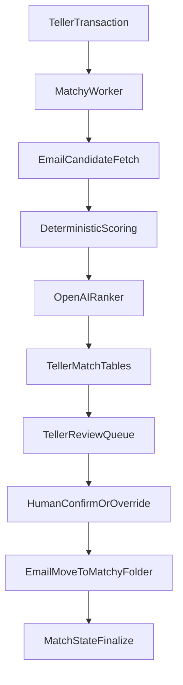

# Matchy Transaction→Email Plan

## Scope And Decisions
- Input starts from Teller transactions; Matchy searches Email messages and proposes/records matches.
- Auto policy: allow `1 transaction -> many emails`; disallow `many transactions -> 1 email` unless human override.
- Human review surface is Teller UI/API; Email UI remains useful for operator inspection/opening messages.
- Persist all match state in Teller DB.

## Existing System Anchors
- Teller transaction source and fields are in [`/Users/phil/local/src/teller/teller/teller_transaction.py`](/Users/phil/local/src/teller/teller/teller_transaction.py) and SQL deploy order in [`/Users/phil/local/src/teller/07_deploy_database.sh`](/Users/phil/local/src/teller/07_deploy_database.sh).
- Teller review/action pattern already exists in classification API/UI:
  - API: [`/Users/phil/local/src/teller/teller/teller_classification_api.py`](/Users/phil/local/src/teller/teller/teller_classification_api.py)
  - macOS UI: [`/Users/phil/local/src/teller/macos-ui/Sources/TransactionClassifier/ClassificationViewModel.swift`](/Users/phil/local/src/teller/macos-ui/Sources/TransactionClassifier/ClassificationViewModel.swift)
- Email search/read and UI bridge exist here:
  - Bridge API: [`/Users/phil/local/src/mailcart/macos_app/Bridge/OutlookClientBridge.h`](/Users/phil/local/src/mailcart/macos_app/Bridge/OutlookClientBridge.h)
  - DTOs: [`/Users/phil/local/src/mailcart/macos_app/Bridge/OutlookBridgeModels.h`](/Users/phil/local/src/mailcart/macos_app/Bridge/OutlookBridgeModels.h)
  - Current auth scope is `Mail.Read` in [`/Users/phil/local/src/mailcart/README.md`](/Users/phil/local/src/mailcart/README.md) (must expand to write scope for folder moves).

## Target Data Model (In Teller DB)
Add new tables under `teller` schema:
- `transaction_email_match_run`
  - `match_run_id` PK, `transaction_id` FK -> `teller.transaction.transaction_id`, `trigger_source` (`auto`,`manual`,`retry`), `model_name`, `prompt_version`, `started_at`, `completed_at`, `status` (`succeeded`,`failed`,`no_candidates`,`needs_review`), `error_text`.
- `transaction_email_candidate`
  - `candidate_id` PK, `match_run_id` FK, `transaction_id` FK, `email_message_id` (external id from email repo), `email_received_at`, `score` (0..1), `reason_json`, `is_unmatched_email_priority` bool, `is_selected_by_ai` bool.
- `transaction_email_match`
  - `match_id` PK, `transaction_id` FK, `email_message_id`, `state` enum (below), `ai_confidence` (0..1), `explanation_json`, `selected_by` (`ai`,`human`), `selected_at`, `moved_to_matchy_at`, `active` bool default true.
  - Unique constraint to enforce no automatic many-to-many explosion:
    - Allow multiple rows for same `transaction_id` (1->many).
    - Prevent one `email_message_id` from being active across multiple transactions unless `state='human_override_ai_match'` (implemented via partial unique index + validation trigger).
- `transaction_email_match_audit`
  - append-only transitions (`from_state`,`to_state`,`actor`,`note`,`created_at`) for traceability.

State enum for `transaction_email_match.state`:
- `ai_no_match_found`
- `ai_candidate_uncertain`
- `ai_match_confident`
- `human_confirmed_ai_match`
- `human_overrode_ai_match`

## Matching Pipeline
1. Matchy receives transaction id (or batch) from Teller.
2. Matchy builds candidate search windows from:
   - `transaction.date` and posted context.
   - parsed initiated timestamp hints from `transaction.description` (when present).
3. Matchy queries Email search API for candidate messages, prioritizing emails not already in active matches.
4. Feature extraction + scoring:
   - amount similarity, merchant/counterparty text similarity, temporal proximity to posted/initiated date, receipt-like phrase matches, sender-domain heuristics.
5. OpenAI ranking/decision step:
   - structured JSON output with selected message ids, confidence, rationale, and uncertainty reason.
6. Persist run + candidates + selected matches.
7. If confidence high and cardinality rules pass, mark `ai_match_confident`; otherwise `ai_candidate_uncertain` or `ai_no_match_found`.
8. For selected/confirmed matches, call Email move API to place message in `matchy` folder and set `moved_to_matchy_at`.

## Cross-Repo API Contracts
- Teller -> Matchy
  - `POST /v1/matchy/runs` with transaction ids (or account/date batch).
- Matchy -> Email
  - `GET/SEARCH` candidates by query/time windows.
  - `POST /messages/{id}/move` (or equivalent) to folder `matchy`.
- Matchy -> Teller
  - Write directly to Teller DB tables or expose Teller internal write endpoints; prefer direct DB writes from Matchy only if operationally safe and credentialed.

## Teller UI Review Flow
Extend existing transaction classifier UX patterns:
- Add Match tab/filter views:
  - `Needs review` (`ai_candidate_uncertain`)
  - `No email found` (`ai_no_match_found`)
  - `AI confident` awaiting human confirm
- Row actions:
  - Confirm AI selection -> `human_confirmed_ai_match`
  - Override to different email(s) -> `human_overrode_ai_match`
  - Mark intentionally no-email (keeps explicit unresolved marker)
- Reuse write-token guarded mutating endpoints pattern from [`/Users/phil/local/src/teller/teller/teller_classification_api.py`](/Users/phil/local/src/teller/teller/teller_classification_api.py).

## Mailcart Repo Changes
- Add message move support to Outlook bridge/client layers (new bridge method and C++ gateway implementation).
- Ensure folder existence logic for `matchy` (create-once if missing, then cache folder id).
- Update Graph scopes from read-only to include write capability and update docs in [`/Users/phil/local/src/mailcart/README.md`](/Users/phil/local/src/mailcart/README.md).
- Keep Email UI as an operator aid (open/read context) but do final confirmation in Teller UI.

## Migration And Rollout
- Add new SQL files in Teller `sql/postgres` and wire them into [`/Users/phil/local/src/teller/07_deploy_database.sh`](/Users/phil/local/src/teller/07_deploy_database.sh) in dependency order.
- Backfill pass:
  - Seed `ai_no_match_found` for legacy transactions only after one attempted run.
- Introduce feature flags:
  - `MATCHY_WRITE_ENABLED`
  - `MATCHY_EMAIL_MOVE_ENABLED`
  - `MATCHY_AUTO_CONFIRM_THRESHOLD`
- Rollout order:
  1. Schema + read-only candidate generation
  2. AI scoring writes (no move)
  3. Human review UI/actions
  4. Enable folder moves

## Testing Strategy
- SQL tests for constraints preventing automatic many-to-many collisions.
- API tests for state transitions and write-token auth on review endpoints.
- Match quality fixtures covering:
  - tight-window receipts
  - delayed receipts (months/year later)
  - no-email cases
  - 1 transaction -> many emails case.
- Integration test for move-to-`matchy` folder success/failure retry semantics.
- Idempotency test: rerunning same transaction should not duplicate active matches.
