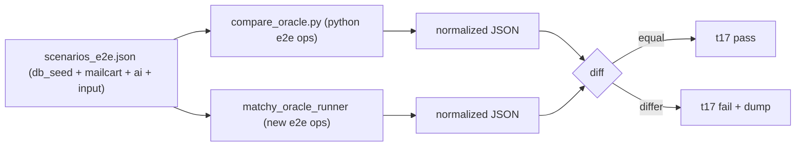

CSS# Complete the matchy C++ cutover with end-to-end parity

## End state (confirmed with you)
- C++ `matchy_api`/`matchy_driver` become the authoritative runtime; `06_run_matchy_api.py`/`07_run_matchy_driver.py` default to launching the C++ binaries.
- Python implementation is **kept in place** (runnable via a `--engine python` fallback) so you can manually A/B test before any retirement.
- "Correct" = the oracle/parity harness is extended to prove byte-parity across the DB, Mailcart HTTP, and AI layers end-to-end, not just the deterministic scoring ops.

## Guiding constraints (do-no-harm)
- No Python production behavior change except **additive, optional** constructor kwargs (defaults identical to today).
- Every existing lane stays green: t00, t04, t05, t06, t08 (mutation), t15, t16, t17, plus pre-commit.
- No `rm`, no Docker, respect umask/permissions, single-return / structured-control-flow C++ style.

## Current state (verified)
- C++ core builds fully today: [src/core/CMakeLists.txt](src/core/CMakeLists.txt) produces `libmatchycore.a`, `matchy_api`, `matchy_driver`, `matchy_oracle_runner`; teller dep present at `../teller/src/core/build-*/libtellercore.a`.
- REST routes/JSON shapes already align between [matchy/api.py](matchy/api.py) and [src/core/tools/matchy_api.cpp](src/core/tools/matchy_api.cpp); the C++ inject seam in [src/core/include/matchycore/match_service.hpp](src/core/include/matchycore/match_service.hpp) is the intended e2e hook.
- Oracle today ([src/core/oracle/compare_oracle.py](src/core/oracle/compare_oracle.py)) only covers `rank`/`collapse`/`simhash`/`cldr_tokens`/`cldr_match`.

---

## Phase 0 - Baseline (prove nothing is broken before touching it)
Run and record green status for: `make core`, `make test` (t15), `make sanitize` (t16), `make parity` (t17), `./tests/t06_run_python_unit_tests.sh`, `./tests/t00_run_code_quality_tests.sh`, `./tests/t04_run_requirements_traceability_tests.sh`. This is the regression gate re-run at the end.

## Phase 1 - Close C++ REST-contract gaps (so cutover is behavior-identical)
Edit [src/core/tools/matchy_api.cpp](src/core/tools/matchy_api.cpp) and [src/core/tools/matchy_driver.cpp](src/core/tools/matchy_driver.cpp):
- Confirm-path 404 detail: return `"Unknown transaction or email message for confirmation."` for `/v1/matchy/confirm` instead of the shared run-error string (route-aware error mapping).
- Confirm `transaction_id` validation: enforce `^txn_[A-Za-z0-9_-]+$` and return 422 (matches Pydantic `TransactionId`).
- 422 body shape: emit a FastAPI-compatible `{"detail":[{"loc":[...],"msg":...,"type":...}]}` for the validated fields so clients that parse validation errors keep working.
- `--profile` flag: in both binaries, set `MATCHY_STARTUP_LOG`/`MATCHY_RUNTIME_PROFILE` and emit the same breadcrumb/heartbeat lines as the Python launchers.
- Port-guard parity: when the port is held by a non-matchy process, fail with an explicit message (mirror `06_run_matchy_api.py` behavior) rather than a raw bind failure.
- Optional docs endpoints: gate `/docs`, `/redoc`, `/openapi.json` behind `MATCHY_ENABLE_API_DOCS` (serve a static OpenAPI doc) to match `create_app()`.
Add/extend Catch2 coverage for the new validation/error mapping in [src/core/tests/](src/core/tests/) (e.g. confirm validation, error-body shape).

## Phase 2 - Entrypoint cutover with Python A/B fallback
Modify [06_run_matchy_api.py](06_run_matchy_api.py) and [07_run_matchy_driver.py](07_run_matchy_driver.py):
- Add `--engine {cpp,python}` (env `MATCHY_ENGINE`, default `cpp`).
- `cpp` branch: ensure the binary is built (invoke cmake build of the `matchy_api`/`matchy_driver` target), then `exec` it, translating the existing CLI flags/env 1:1 (all already supported after Phase 1).
- `python` branch: the current uvicorn/requests code path, unchanged, for manual A/B.
- Keep `make run`/`make driver` as-is (already C++).
Update [README.md](README.md) and [Architecture.md](Architecture.md) to describe C++ as authoritative with the Python fallback and the A/B procedure.

## Phase 3 - End-to-end parity harness (DB + Mailcart + AI)
This is the core verification work and the hardest part (Python lacks the seams C++ has).

Steps:
- Python injectable seam (additive, production-safe): add optional kwargs to `MatchService.__init__` in [matchy/service.py](matchy/service.py) - `repository=None, mailcart_client=None, ai_ranker=None` - defaulting to today's internal construction. This mirrors the C++ inject ctor and removes the need for `object.__new__` in parity.
- Python sqlite parity fixture: build a temp SQLCipher DB from the teller DDL (`../teller/sql/sqlite/create_database.sql`, same file the C++ `TELLER_SQLITE_DDL_PATH` uses) and the same seed graph as [src/core/tests/fixture.hpp](src/core/tests/fixture.hpp) (institution/account/`txn-1`/`txn-2`). Provide a parity-only conftest that does NOT pin `_IS_SQLITE=False` (the unit-lane stub in [tests/py/conftest.py](tests/py/conftest.py) forces postgres SQL).
- New C++ oracle ops in [src/core/tools/oracle_runner.cpp](src/core/tools/oracle_runner.cpp): `match_transaction`, `match_pending`, `confirm` - construct `MatchService` via inject ctor using a fixture-seeded sqlite DB plus scenario-provided stub `MailcartApi`/`AiTransport`, then dump normalized result JSON.
- New Python ops in [src/core/oracle/compare_oracle.py](src/core/oracle/compare_oracle.py): same scenarios through the real Python `MatchService` using the injectable seam + sqlite fixture + fake Mailcart client + fake AI transport.
- Scenario fixtures: add `scenarios_e2e.json` carrying `settings`, `db_seed`, recorded `mailcart` (search/get/move maps), recorded `ai` (anthropic/openai replies, incl. deterministic-fallback empty-key case), `input`, and `expect`.
- Normalization: reuse `FLOAT_PRECISION=6`; normalize/strip nondeterministic DB-generated fields (`run_id`, `match_id`, wall-clock timestamps) to placeholders so the meaningful contract (selected_message_ids, scores/reasons, state/status, skip behavior, cache-hash) is what gets diffed. Watch `email_received_at` formatting (already documented in the C++ cache test).
- Wire the new e2e scenarios into [tests/t17_run_python_cpp_oracle_parity_test.sh](tests/t17_run_python_cpp_oracle_parity_test.sh) (build the runner, run both deterministic + e2e scenario sets).

## Phase 4 - Fill remaining per-module gaps
- Add Catch2 tests for `caching.cpp` and `match_writer.cpp` (no dedicated tests today) and register them in [src/core/CMakeLists.txt](src/core/CMakeLists.txt) test list.
- Decide `runtime_profile.py`: it is just `MATCHY_RUNTIME_PROFILE` stdout breadcrumbs; cover it via the Phase 1 `--profile` breadcrumbs in C++ (no standalone module needed). Note this explicitly in Architecture.md.
- Update the C++ migration table + traceability requirements docs under [requirements/](requirements/) to reflect cutover + e2e parity coverage.

## Phase 5 - Full verification + manual A/B
- Re-run the entire Phase 0 lane set plus the extended t17 and the new C++ unit tests; all must be green.
- Run pre-commit ([.pre-commit-config.yaml](.pre-commit-config.yaml)).
- Provide a short manual A/B script in the docs: start C++ API, run driver `--once`; start Python API (`--engine python`), run driver against it; compare `/health`, a `/v1/matchy/runs` response, and a `/v1/matchy/confirm` against the same DB snapshot.

## Key risks / decisions
- 422 validation-body fidelity: exact FastAPI array reproduction in C++ is the brittlest item; plan targets a structurally-compatible body for the known fields. Flag if you want byte-exact FastAPI emulation.
- DB parity determinism: requires running Python against real sqlite (not the postgres-pinned unit lane) and normalizing auto-generated ids; this is the biggest new wiring.
- Teller dependency: e2e DB parity assumes `../teller` sqlite DDL + `libtellercore` stay buildable (currently true).
- Mutation lane (t08) must stay green - it only mutates `scoring_core.py`/`models.py`, untouched here.