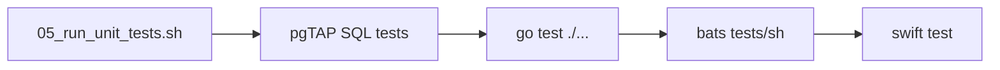
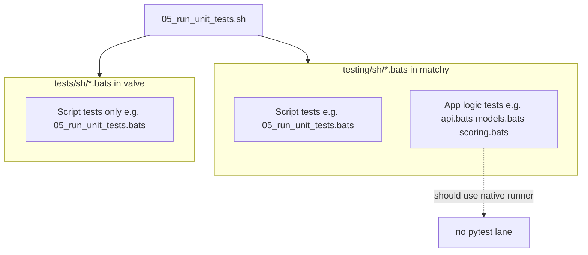
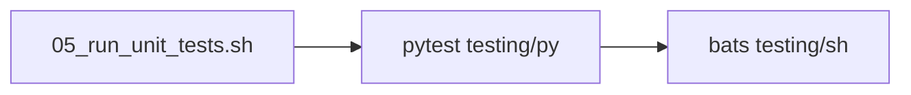

# Why Matchy Has `.bats` for Python (and How It Differs from Valve)

## Short Answer

Your confusion is justified. Matchy **does not** follow valve's "dedicated runner per language" model today. It runs **everything** through Bats, including Python module tests. The parallel [`testing/py/`](testing/py/) files are **traceability placeholders** — they satisfy [`00_verify_requirements_traceability.sh`](00_verify_requirements_traceability.sh) but are **never executed** by [`05_run_unit_tests.sh`](05_run_unit_tests.sh).

---

## How Valve Does It (the model you expect)

In [`../valve/05_run_unit_tests.sh`](../valve/05_run_unit_tests.sh), one orchestrator invokes **native runners in sequence**:



Each lane has a clear boundary:

| What is tested | Runner | Where tests live |
|---|---|---|
| PostgreSQL schema | pgTAP | `storage/sql/unit/*.sql` |
| Go packages | `go test` | `*_test.go` colocated with source |
| Shell automation scripts | Bats | `tests/sh/NN_*.bats` mirrors `NN_*.sh` |
| Swift macOS app | `swift test` | `macos/.../Tests/` |

Bats in valve **never** runs Go or Swift application logic. It only verifies that numbered repo scripts (`05_run_unit_tests.sh`, `07_run_security_checks.sh`, etc.) behave correctly under stubs.

---

## How Matchy Actually Works Today

[`05_run_unit_tests.sh`](05_run_unit_tests.sh) does one thing:

```bash
bats "${REPO_ROOT}"/testing/*.bats "${REPO_ROOT}"/testing/sh/*.bats
```

There is no `pytest`, no `python -m unittest`, and **pytest is not in [`requirements.txt`](requirements.txt)**.

### Two test directories, but only one runs

| Directory | Purpose today | Executed? |
|---|---|---|
| [`testing/sh/*.bats`](testing/sh/) | **All real tests** — both shell-script tests AND Python app tests | Yes |
| [`testing/py/test_*.py`](testing/py/) | Traceability stubs (`assert True` + `#Rxxx` tag comments) | No |

Example of the split for `matchy/api.py`:

- **Real tests** live in [`testing/sh/api.bats`](testing/sh/api.bats) — Bats shells out to inline Python:

```4:14:testing/sh/api.bats
@test "api health endpoint returns status ok" {
  run env PYTHONPATH="$(pwd)" TELLER_DB_PASSWORD="pw" "$(pwd)/matchy-venv/bin/python3" - <<'PY'
from fastapi.testclient import TestClient
from matchy.api import create_app
response = TestClient(create_app()).get("/health")
print(response.status_code == 200 and response.json().get("status") == "ok")
PY
  [ "$status" -eq 0 ]
  [ "$output" = "True" ]
}
```

- **Placeholder** in [`testing/py/test_api.py`](testing/py/test_api.py):

```6:7:testing/py/test_api.py
def test_traceability_tags_api() -> None:
    assert True
```

### Why both lanes exist

[`00_verify_requirements_traceability.sh`](00_verify_requirements_traceability.sh) (inherited from valve) enforces **dual discovery** for Python sources (R050):

- `testing/sh/{stem}.bats` — discovered for traceability tag checks
- `testing/py/test_{stem}.py` — **required to exist** via `verify_python_test_lane_coverage()`, or traceability fails

So the Python lane is a **file-existence gate**, not a test runner.

### Historical reason (from changelogs)

[`requirements/05_run_unit_tests-requirements.md`](requirements/05_run_unit_tests-requirements.md) changelog (2026-05-12):

> Reswizzled from copied Swift+Tests contract to Matchy Bats-based `testing/` lanes.

Matchy kept valve's traceability scaffolding (numbered scripts, R### IDs, dual lanes) but simplified execution to **Bats-only** when bootstrapping a Python project. Python logic was embedded in Bats via `python3 -c` / heredocs rather than introducing pytest.

---

## What `.bats` Files Exist For (two different roles, conflated)

In matchy today, `testing/sh/` mixes two concerns that valve keeps separate:



| File pattern | Valve role | Matchy role today |
|---|---|---|
| `testing/sh/05_run_unit_tests.bats` | Tests the shell script | Same (correct) |
| `testing/sh/api.bats` | Would not exist | Tests `matchy/api.py` via inline Python |
| `testing/py/test_api.py` | N/A (no py lane in valve) | Stub for traceability only |

---

## Why This Feels Wrong

1. **Bats is being used as a Python test harness** — awkward heredocs, stringly assertions (`[ "$output" = "True" ]`), no pytest fixtures/parametrize.
2. **Duplicate, divergent test locations** — real logic in `.bats`, empty stubs in `testing/py/`.
3. **Orchestrator doesn't match valve** — valve's `05_run_unit_tests.sh` is a multi-runner pipeline; matchy's only runs Bats.
4. **README doesn't document testing** — [`README.md`](README.md) has no `./05_run_unit_tests.sh` section.

---

## If You Want Valve-Parity (optional remediation)

Align matchy with valve's pattern: **native runner for app code, Bats for shell scripts only**.

### Target architecture



### Concrete changes

1. **Add pytest** to [`requirements.txt`](requirements.txt), install via [`./03_load_requirements.sh`](03_load_requirements.sh).
2. **Extend [`05_run_unit_tests.sh`](05_run_unit_tests.sh)** to run pytest first (with printed runner header like valve), then Bats — mirroring valve's staged pipeline.
3. **Move Python tests** from inline Bats (`api.bats`, `models.bats`, `scoring.bats`, etc.) into real [`testing/py/test_*.py`](testing/py/) files using pytest + FastAPI TestClient.
4. **Delete or slim module `.bats` files** — keep only numbered-script Bats (`05_run_unit_tests.bats`, `00_verify_requirements_traceability.bats`, etc.).
5. **Update requirements docs** — [`requirements/05_run_unit_tests-requirements.md`](requirements/05_run_unit_tests-requirements.md) and per-module requirements under [`requirements/matchy/`](requirements/matchy/) to reference pytest execution.
6. **Document** in README: `./05_run_unit_tests.sh` as the unit-test entry point.

### Files most affected

- [`05_run_unit_tests.sh`](05_run_unit_tests.sh) — add pytest stage
- [`testing/py/test_*.py`](testing/py/) — replace stubs with real tests (migrate from `.bats`)
- [`testing/sh/api.bats`](testing/sh/api.bats), [`models.bats`](testing/sh/models.bats), [`scoring.bats`](testing/sh/scoring.bats), etc. — remove after migration
- [`requirements/05_run_unit_tests-requirements.md`](requirements/05_run_unit_tests-requirements.md) — new R### entries for pytest stage
- [`requirements.txt`](requirements.txt) — add pytest

### What stays the same

- Numbered top-level scripts (`00`–`09`) and their Bats specs
- [`00_verify_requirements_traceability.sh`](00_verify_requirements_traceability.sh) dual-lane discovery (it would finally match reality)
- Security/AV/freshness lanes unchanged

---

## Bottom Line

The `.bats` files for Python exist because matchy **chose Bats as the sole test executor** during its 2026-05-12 reswizzle, while still inheriting valve's traceability rule that **`testing/py/test_*.py` must exist**. That creates the confusing split: Bats runs the real Python tests; `testing/py/` is a compliance artifact.

Valve avoids this by giving each language its own runner inside one orchestrator. Matchy can reach parity by adding a pytest stage and restricting Bats to shell-script testing — the same separation valve uses between `go test` and `bats tests/sh`.
