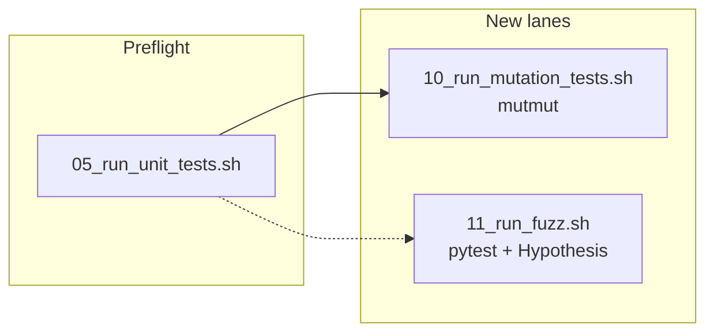

# Mutation and property-fuzz lanes (10 / 11)

## Goal

Port the **intent** of [valve/06_run_mutation_tests.sh](../valve/06_run_mutation_tests.sh) and [valve/12_run_fuzz.sh](../valve/12_run_fuzz.sh) into matchy as Python-native gates at **slots 10 and 11** (matchy `06` is already [06_run_security_checks.sh](06_run_security_checks.sh)).




## Tooling choices


| Valve lane    | Matchy lane                | Tool                    | Notes                                                                                           |
| ------------- | -------------------------- | ----------------------- | ----------------------------------------------------------------------------------------------- |
| `06` mutation | `10_run_mutation_tests.sh` | **mutmut**              | pytest runner; config in [pyproject.toml](pyproject.toml); full `matchy/` scope per your choice |
| `12` fuzz     | `11_run_fuzz.sh`           | **Hypothesis** + pytest | Property-based analog to Go fuzz; no atheris/libFuzzer in v1                                    |


Dependencies: add `mutmut` and `hypothesis` to [requirements.txt](requirements.txt). **Do not edit** locked scripts [00_verify_requirements_traceability.sh](00_verify_requirements_traceability.sh), [01_install_prerequisites.sh](01_install_prerequisites.sh), or [03_load_requirements.sh](03_load_requirements.sh); operator runs `activate` then `./03_load_requirements.sh` after the requirements change.

## 1. Configure mutmut (`pyproject.toml`)

Extend [pyproject.toml](pyproject.toml):

```toml
[tool.mutmut]
paths_to_mutate = ["matchy/"]
tests_dir = "tests/py"
runner = "python -m pytest -x -q --tb=no"
# Exclude I/O, DB, HTTP, AI — not meaningfully mutation-tested without heavy mocks
also_exclude = [
  "matchy/api.py",
  "matchy/repository.py",
  "matchy/mailcart_client.py",
  "matchy/ai_ranker.py",
  "matchy/service.py",
  "matchy/settings.py",
]
```

Env overrides in the shell script (not pyproject): `MUTATION_SCORE_THRESHOLD` (default `80`), `MUTATOR_COVERAGE_THRESHOLD` (default `70` — computed from mutmut stats, see below), `MUTATION_REPORT_DIR` (default `./.security-reports`), `MUTATION_TIMEOUT_SECONDS` (default `600`), optional `MUTATION_PATHS` / extra excludes if needed later.

`min_score` can stay in the script gate (like valve's Python post-processor) so thresholds remain env-driven without editing pyproject on every tune.

## 2. `10_run_mutation_tests.sh`

Mirror valve 06 structure; reuse patterns from [05_run_unit_tests.sh](05_run_unit_tests.sh) (venv python) and [06_run_security_checks.sh](06_run_security_checks.sh) (reports dir, python summary).

**Flow:**

1. `umask 007`, `set -euo pipefail`, `cd` to repo root via `SCRIPT_DIR`.
2. Resolve `PYTHON_BIN="${REPO_ROOT}/matchy-venv/bin/python"`; fail with guidance to run `02` + `03` if missing.
3. Require `mutmut` in venv: `"$PYTHON_BIN" -m mutmut --version` (fail with “run ./03_load_requirements.sh”).
4. **Preflight (R010):** `PYTHONPATH=$REPO_ROOT "$PYTHON_BIN" -m pytest tests/py` — abort if non-zero; message points to `./05_run_unit_tests.sh`; do not invoke mutmut on failure.
5. **Run mutmut (R015):** `cd "$REPO_ROOT"`; wrap in the same `run_with_timeout` Python helper as valve 06 (copy inline heredoc) calling:
  - `"$PYTHON_BIN" -m mutmut run --no-progress`
  - Capture stdout/stderr to a temp log; treat exit `124` as timeout failure.
6. **Parse results (R020, R022, R030, R035):** Python post-processor (valve-style) reading mutmut’s result state:
  - Primary: parse `mutmut results` text or JSON if `json_output` is enabled in config (`mutation-report.json` under `REPORT_DIR`).
  - Compute **score** = killed / (killed + survived) × 100 (map mutmut terminology: killed vs survived/timeout).
  - Compute **mutator coverage** = (killed + survived) / total_mutants × 100 (exclude not-covered / skipped from denominator where mutmut reports them — align field names in summary JSON).
  - Gate: fail if score < `MUTATION_SCORE_THRESHOLD` OR coverage < `MUTATOR_COVERAGE_THRESHOLD`.
  - Write `${REPORT_DIR}/mutation-summary.json` with: `total`, `killed`, `survived`, `skipped`, `timed_out`, `score`, `mutator_coverage`, thresholds, `gate_failed`, `by_module` (prefix `matchy/scoring`, `matchy/models`, etc.).
  - Print per-module one-liners and single `PASS` / `FAIL` line.
7. Fail if mutmut produced no mutants / empty results (valve R015 “no JSON” analog).

**Header:** use `print_runner_header` from 05 (mutmut URL).

## 3. Hypothesis tests + `11_run_fuzz.sh`

**New test module:** [tests/py/test_scoring_properties.py](tests/py/test_scoring_properties.py)

Property tests targeting [matchy/scoring.py](matchy/scoring.py) (pure logic, no DB):

- `@given(...)` random but bounded `TransactionInput` / `EmailCandidate` data (use `hypothesis.strategies` + `datetime`/`Decimal` strategies).
- Invariants: no exception; all scores in `[0, 0]`; `rank_candidates` output sorted non-increasing; empty candidate list → empty result; normalization/idempotence on `_normalized_text` via public `rank_candidates` behavior where applicable.
- Mark files with requirement traceability comments (`#R001`, etc.) matching the new requirements doc.

**Script flow (valve 12 shape):**

1. Strict mode + repo root.
2. Require venv python + `hypothesis` importable.
3. Env: `FUZZ_TEST_PATHS` (default `tests/py/test_scoring_properties.py`), `FUZZ_MAX_EXAMPLES` (default `200`), `FUZZ_DEADLINE_MS` (default `500`).
4. Run: `PYTHONPATH=$REPO_ROOT HYPOTHESIS_PROFILE=... "$PYTHON_BIN" -m pytest "$FUZZ_TEST_PATHS" -q` with `hypothesis` settings applied via env or `@settings(max_examples=..., deadline=...)` in the test module (prefer module-level `@settings` for reproducibility).
5. **R020:** Document in requirements/README that Hypothesis “shrinking” and `new interesting`-style stats are informational; only pytest failures fail the lane.
6. Single `PASS` / `FAIL` line; non-zero pytest exit → fail.

No separate custom runner — only pytest (consistent with [no-new-testing-frameworks](.cursor/rules/testing/no-new-testing-frameworks.mdc)).

## 4. Requirements and traceability

Add:

- [requirements/10_run_mutation_tests-requirements.md](requirements/10_run_mutation_tests-requirements.md) — port valve 06 requirement IDs (R001, R005, R010, R015, R020, R022, R025, R030, R035, R040) adapted for mutmut/venv.
- [requirements/11_run_fuzz-requirements.md](requirements/11_run_fuzz-requirements.md) — port valve 12 (R001, R005, R010, R015, R020).

Tag scripts and bats with `#Rnnn` / `#Rnnn-Tnn` comments. [00_verify_requirements_traceability.sh](00_verify_requirements_traceability.sh) will pick up new `*-requirements.md` files automatically.

## 5. Bats coverage

Add stub-based specs (pattern from [tests/sh/05_run_unit_tests.bats](tests/sh/05_run_unit_tests.bats) and [valve/tests/sh/06_run_mutation_tests.bats](../valve/tests/sh/06_run_mutation_tests.bats)):

- [tests/sh/10_run_mutation_tests.bats](tests/sh/10_run_mutation_tests.bats): missing venv/mutmut; preflight fails → mutmut not called; timeout exit 124; score/coverage below threshold; pass path; custom env thresholds; report file written.
- [tests/sh/11_run_fuzz.sh](tests/sh/11_run_fuzz.bats): missing hypothesis; non-repo cwd; pytest failure; pass path; default paths in invocation log.

Use `copy_script_to_fixture`, venv python stub, and `CALLS_LOG` like existing tests.

## 6. Docs and discoverability

Update [README.md](README.md) **Test** section:

```bash
./05_run_unit_tests.sh
./10_run_mutation_tests.sh   # optional; slow
./11_run_fuzz.sh
```

Note: `10` should run after `05` passes; `11` can run standalone but is fastest when unit tests are already green.

**Do not edit** [requirements/01_install_prerequisites-requirements.md](requirements/01_install_prerequisites-requirements.md) R025 (locked script references) unless you explicitly unlock `01` — README carries the new commands instead.

## 7. Security / permissions

After creating files: `chmod 660` files, `chmod 770` dirs, `chmod 770` on `10_run_mutation_tests.sh` and `11_run_fuzz.sh` (executable scripts per umask rules).

Ensure [06_run_security_checks.sh](06_run_security_checks.sh) ShellCheck glob picks up `10_*.sh` and `11_*.sh` via existing `*.sh` pattern.

## 8. Verification (implementation phase)

1. `activate` && `./03_load_requirements.sh`
2. `./05_run_unit_tests.sh`
3. `./10_run_mutation_tests.sh` (expect long runtime on full `matchy/`; tune thresholds if first run is noisy)
4. `./11_run_fuzz.sh`
5. `./00_verify_requirements_traceability.sh`

## Out of scope (v1)

- **atheris** / libFuzzer harnesses
- Parallel “run all checks” orchestrator (valve `13`)
- Editing locked `01` / `03` install scripts
- Mutation of excluded modules (`api`, `repository`, `mailcart_client`, `ai_ranker`, `service`, `settings`)

