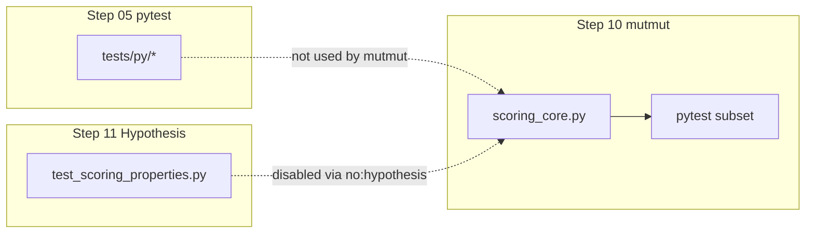

# Mutation score 90% for scoring_core

## Diagnosis

Current gate failure: **45 killed / 61 survived** on `[matchy/scoring_core.py](matchy/scoring_core.py)` → **42.45%** (106 mutants total per `[mutants/mutmut-cicd-stats.json](mutants/mutmut-cicd-stats.json)`).




**Root cause (config + assertion strength):**

1. `[pyproject.toml](pyproject.toml)` limits mutmut to only:
  - `[tests/py/test_scoring.py](tests/py/test_scoring.py)` (2 integration tests via `rank_candidates`)
  - `[tests/py/test_models.py](tests/py/test_models.py)`
  - `pytest_add_cli_args = ["-p", "no:hypothesis"]` → **property tests never run during mutation**
2. `[mutants/mutmut-stats.json](mutants/mutmut-stats.json)` confirms every `scoring_core` function is exercised only by those two integration tests.
3. Existing assertions are too weak to kill mutants:
  - `description_overlap > 0` survives many `normalized_text` / `token_overlap` mutants
  - `rank_candidates` caps `time_score` at 1.0 via `min(1.0, …)`, so `time_proximity_score` mutants returning `2.0` or wrong bucket values can survive
  - `[tests/py/test_scoring_properties.py](tests/py/test_scoring_properties.py)` only checks **bounds** (`0.0 <= score <= 1.0`), which equivalent mutants still satisfy

**Target math:** ≥90% ⇒ at most **~10 survived** out of 106 (need **≥96 killed**). Must add **~50+** targeted kills via new tests.

---

## Strategy (legitimate, no gaming)


| Approach                                          | Use? | Why                                                                |
| ------------------------------------------------- | ---- | ------------------------------------------------------------------ |
| Direct unit tests with **exact** expected outputs | Yes  | Primary fix; kills boundary/operator mutants                       |
| Wire new tests into `tool.mutmut.tests_dir`       | Yes  | Otherwise mutmut never sees them                                   |
| Keep Hypothesis **out** of mutmut                 | Yes  | Fast, deterministic macOS subprocess driver; fuzz stays in step 11 |
| `do_not_mutate` / exclude files                   | No   | Would fake the score                                               |
| Weaken assertions                                 | No   | Already the problem                                                |


**Order of work:** build tests → verify `./10_run_mutation_tests.sh` ≥90% → **then** raise default `MUTATION_SCORE_THRESHOLD` to 90.

---

## Phase 1: Add `tests/py/test_scoring_core.py` (mutation-killer suite)

New file with **direct imports** of `matchy.scoring_core` and **exact** assertions (not `rank_candidates` wrappers). Tag each test with requirement IDs (`#R010-T01`, etc.) matching expanded requirements doc.

### `normalized_text` (~11 mutants)

- Lowercase: `"HeLLo"` → `"hello"`
- Punctuation → space: `"a,b;c"` → `"a b c"`
- Preserves digits/spaces: `"x1 y2"`
- Regression string that kills wrong-regex mutants (e.g. mixed case punctuation)

### `token_overlap` (~18 mutants)

- Empty / whitespace-only → `0.0`
- Short tokens (len ≤2) excluded: `"ab ab"` vs `"abc abc"` with known ratio
- Partial overlap with **exact** ratio, e.g. `"foo bar baz"` vs `"foo bar qux"` → `2/3`
- Denominator uses **max** side length (mutant `min` vs `max`)
- Guard-condition mutants: one side has tokens, other empty → `0.0`

### `amount_hint_score` (~13 mutants)

- `EmailCandidate` fixtures with subject/preview/body containing each hint form:
  - `"{amount:.2f}"`, `"{abs(amount):.2f}"`, `"${abs(amount):.2f}"`, `str(int(abs(amount)))`
- Negative amount still matches positive hint text
- No amount in text → `0.0`
- Assert **exact** `1.0` / `0.0` (not `> 0`)

### `sender_hint_score` (~21 mutants)

- Shared token (len >2) → `1.0`
- No overlap → `0.0`
- Short-only tokens → `0.0`
- Empty sender or txn text → `0.0`

### `compact_merchant_hint_score` (~23 mutants)

- Empty candidate text → `0.0`
- Merchant token len ≥6 embedded in compact candidate (punctuation stripped) → `1.0`
- Token len 5 ignored; digit-only token ignored
- No substring match → `0.0`

### `time_proximity_score` (~20 mutants)

Parametrize `received_at - txn_time` at bucket edges (use fixed `timezone.utc` base):


| Δ hours   | Expected |
| --------- | -------- |
| 0         | 1.0      |
| 6         | 1.0      |
| 6 + ε     | 0.85     |
| 24        | 0.85     |
| 24 + ε    | 0.65     |
| 72        | 0.65     |
| 72 + ε    | 0.3      |
| 24×30     | 0.3      |
| 24×30 + ε | 0.1      |


Also test **reverse** ordering (`received_at` before `txn_time`) uses `abs`. Assert **exact floats**, not capped integration scores.

Keep existing integration tests in `[tests/py/test_scoring.py](tests/py/test_scoring.py)` for `rank_candidates` behavior (R001/R005).

---

## Phase 2: Register tests with mutmut

Update `[pyproject.toml](pyproject.toml)`:

```toml
tests_dir = [
  "tests/py/test_scoring_core.py",
  "tests/py/test_scoring.py",
  "tests/py/test_models.py",
]
```

Keep `pytest_add_cli_args = ["-p", "no:hypothesis"]` (mutation lane stays fast/deterministic).

After adding tests, re-run mutmut so `mutants/mutmut-stats.json` maps each function to the new tests (verify with `python -m mutmut results` or inspect stats).

---

## Phase 3: Expand requirements (traceability)

### `[requirements/matchy/scoring-requirements.md](requirements/matchy/scoring-requirements.md)`

Add scoped requirements per helper (examples):

- **R010** `normalized_text`: lowercase + non-alphanumeric → space
- **R015** `token_overlap`: min token length 3, Jaccard-style ratio, empty → 0
- **R020** `amount_hint_score`: four hint formats, binary 1.0/0.0
- **R025** `sender_hint_score`: shared long-token match, binary 1.0/0.0
- **R030** `compact_merchant_hint_score`: compact substring, len≥6 non-digit tokens
- **R035** `time_proximity_score`: documented hour buckets (6/24/72/720)
- Keep **R001/R005** for integration normalization + sort order

Each requirement gets `Rxxx-T01`… tests in `test_scoring_core.py` / existing integration tests.

### `[requirements/10_run_mutation_tests-requirements.md](requirements/10_run_mutation_tests-requirements.md)`

- **R020**: Change default `MUTATION_SCORE_THRESHOLD` from **80 → 90** (after score is proven)
- Add **R045**: Statement that mutmut pytest scope MUST include `tests/py/test_scoring_core.py` for `scoring_core` modules
- Changelog entry dated 2026-05-20

### `[requirements/11_run_fuzz-requirements.md](requirements/11_run_fuzz-requirements.md)` (secondary)

- Add **R030**: Semantic property tests for scoring buckets/normalization (not only bounds), referenced from `test_scoring_properties.py`

---

## Phase 4: Strengthen fuzz properties (step 11 alignment)

In `[tests/py/test_scoring_properties.py](tests/py/test_scoring_properties.py)`, add/replace weak checks:

- `test_time_proximity_matches_bucket_for_known_deltas` — structured `@given` with fixed deltas → exact bucket value
- `test_normalized_text_strips_non_alnum` — charset invariant stronger than “lowercase only”
- Optional: `test_token_overlap_exact_for_constructed_pairs` with controlled token sets

Keeps fuzz lane meaningful; does **not** replace unit tests for mutmut.

---

## Phase 5: Raise gate + update docs/scripts/tests


| File                                                                                                       | Change                                                                                                              |
| ---------------------------------------------------------------------------------------------------------- | ------------------------------------------------------------------------------------------------------------------- |
| `[10_run_mutation_tests.sh](10_run_mutation_tests.sh)`                                                     | `MUTATION_SCORE_THRESHOLD` default **90**                                                                           |
| `[tests/sh/10_run_mutation_tests.bats](tests/sh/10_run_mutation_tests.bats)`                               | Pass fixture ≥90% (e.g. 90 killed / 10 survived); fail fixture below 90                                             |
| `[README.md](README.md)`                                                                                   | Document 90% gate, new `test_scoring_core.py`, workflow: `05` → `11` → `10`; note mutmut uses non-Hypothesis subset |
| `[requirements/10_run_mutation_tests-requirements.md](requirements/10_run_mutation_tests-requirements.md)` | R020 default + R045 scope                                                                                           |


---

## Phase 6: Iterate until green

```bash
activate
./05_run_unit_tests.sh          # all pytest including new file
./10_run_mutation_tests.sh      # measure score
# if survivors remain:
python -m mutmut show <id>      # inspect equivalent/survived
# add pinpoint tests, re-run
```

**Exit criteria:**

- `./10_run_mutation_tests.sh` prints `✅ PASS` with score **≥90%**
- `./05_run_unit_tests.sh` and `./11_run_fuzz.sh` still pass
- Bats `tests/sh/10_run_mutation_tests.bats` pass with updated thresholds

**If score stalls ~85–89%:** inspect survivors—likely need one more boundary test per function (especially `sender_hint_score` and `compact_merchant_hint_score`, largest mutant counts).

---

## Risk notes

- **Do not** add Hypothesis to mutmut `tests_dir` without measuring runtime/regressions on macOS driver (`[tools/mutmut_darwin.py](tools/mutmut_darwin.py)`).
- **Do not** raise threshold to 90 before empirical score ≥90 (would block CI prematurely).
- `models.py` shows 0 mutants in current run; no change needed unless mutator coverage expands later.

