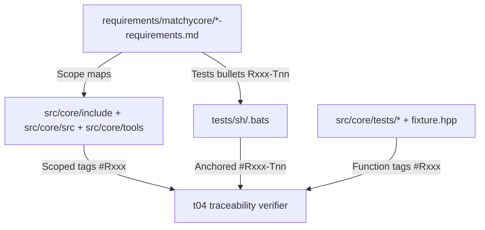

# Matchycore Traceability Completion Plan

## Scope and Success Criteria

- Make `./tests/t04_run_requirements_traceability_tests.sh` pass with zero missing `src/core` files and zero function-tag coverage misses.
- Use a dedicated C++ requirements tree under `[requirements/matchycore/](requirements/matchycore/)` (your selected direction).
- Keep existing Python requirements docs intact, but reuse their requirement IDs where C++ is a direct port.

## Mapping Strategy

- Add subsystem requirements docs under `[requirements/matchycore/](requirements/matchycore/)` covering all currently uncovered files:
  - `ai_ranker`, `caching`, `cldr`, `enrichment`, `mailcart`, `match_service`, `models`, `near_duplicate`, `repository` (includes `match_writer.cpp`), `scoring`, `search`, `settings`, `timeutil`, `version`, `matchy_api`, `matchy_driver`, `oracle`.
- For each doc, set `## Scope` with explicit backtick paths to both headers and sources (e.g. `[src/core/include/matchycore/ai_ranker.hpp](src/core/include/matchycore/ai_ranker.hpp)`, `[src/core/src/ai_ranker.cpp](src/core/src/ai_ranker.cpp)`).
- Reuse existing ID bands from matching Python docs for parity modules (for example `[requirements/matchy/ai_ranker-requirements.md](requirements/matchy/ai_ranker-requirements.md)`, `[requirements/matchy/scoring-requirements.md](requirements/matchy/scoring-requirements.md)`); allocate a new reserved band only for C++-only surfaces (`timeutil`, `version`, `oracle`, tool-only glue).

## Test Discovery and Numbered-Test Traceability

- Because the checker only auto-discovers numbered tests in `.py`, `.bats`, and `.swift`, add companion Bats files per new C++ requirements stem in `[tests/sh/](tests/sh/)` (for example `tests/sh/ai_ranker.bats`, `tests/sh/repository.bats`, `tests/sh/oracle.bats`).
- In each new Bats file:
  - Add scoped `#Rxxx:` tags for requirement coverage.
  - Add `#Rxxx-Tnn:` tags inside `@test` blocks to satisfy numbered-test 1:1 mapping and anchoring.
- Keep tests executable and deterministic (simple assertions/commands with stable pass conditions) so they integrate safely with existing shell test lanes.

## Source Tagging Pass (Function Coverage)

- Normalize existing C++ tags from `//Rxxx` to scoped `// #Rxxx: ...` where needed across:
  - `[src/core/include/matchycore/](src/core/include/matchycore/)`
  - `[src/core/src/](src/core/src/)`
  - `[src/core/tools/](src/core/tools/)`
- Add missing scoped tags for parser-detected functions (including inline methods, constructors, helper functions in anonymous namespaces, and utility methods).
- Add scoped tags to parser-detected helper/test functions in `[src/core/tests/](src/core/tests/)` and `[src/core/tests/fixture.hpp](src/core/tests/fixture.hpp)` to eliminate global function-tag failures.

## Validation Loop

- Run `./tests/t04_run_requirements_traceability_tests.sh` after each subsystem batch and resolve remaining misses by category:
  - repository file coverage
  - strict pair/scoped tag mismatches
  - numbered test traceability/anchoring
  - function-tag coverage
- Run `./tests/t05_run_shell_unit_tests.sh` before final handoff to confirm newly added Bats files are stable under the existing shell test lane.

## Rollout Order

1. Create `requirements/matchycore/*` docs + matching `tests/sh/*.bats` stubs for discovery.
2. Complete source-tag normalization and missing tags in `include/src/tools`.
3. Tag `src/core/tests/*` helper functions.
4. Iterate t04 to zero, then run shell unit tests for regression confidence.

